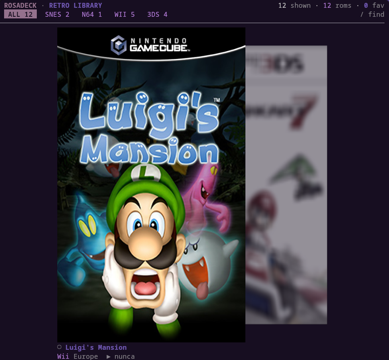

<p align="center">
  
</p>

# Rosadeck

**Un espacio para jugar emuladores de una manera rápida y fácil, sin complicaciones.**

Rosadeck es un gestor de pantallas y emuladores para Wayland/Hyprland, con una
biblioteca de juegos en terminal que se lee como un carrusel de carátulas: la
portada enfocada a resolución nativa, las vecinas más pequeñas y desenfocadas
por la distancia, sin marcos ni adornos. Se dibuja con el protocolo gráfico de
kitty, así que las carátulas son imágenes de verdad y no bloques de texto.

```bash
rosadeck          # abre el navegador de la biblioteca
rosadeck --help   # el CLI: play, library, displays, modes, duplicate…
```

## Qué hace

| | |
|---|---|
| **Biblioteca** | Escanea `~/roms/<plataforma>/`, encuentra la carátula por convención y las trae como imágenes reales. Filtros por plataforma, búsqueda y favoritos. |
| **Lanzamiento** | Un `⏎` y el juego se abre **a pantalla completa**, con el perfil de pantalla aplicado y restaurado al salir. |
| **Pantallas** | Clonar, extender o pasar a la externa con un plan que se puede revisar antes de aplicar nada (`--dry-run`), y restaurar el último perfil guardado. |
| **Estética** | Paleta de pywal si la hay, tipografía verificada contra la fuente real del terminal, y nada de iconos que la fuente no tenga. |

## Requisitos

- **Hyprland** (el backend habla `hyprctl`; el camino DisplayLink/DRM/EDID está
  soportado pero el probado es Hyprland).
- **kitty** como terminal: las carátulas viajan por su protocolo gráfico y el
  navegador necesita que la terminal lea ficheros del disco (`t=f`) para que la
  estantería siga a las flechas.
- **Rust estable** para compilar.

## Instalar

```bash
git clone https://github.com/Nix-rosa/rosadeck.git ~/rosadeck
cd ~/rosadeck
cargo build --release
install -m755 target/release/rosadeck target/release/rosadeck-library ~/.local/bin/
```

`~/.local/bin` no suele estar en el `PATH` de una sesión de login. Añade esto a
tu `~/.profile` o a tu configuración de shell:

```bash
export PATH="$HOME/.local/bin:$PATH"
```

## Romanes y carátulas

Convención sobre configuración: `~/roms/<plataforma>/<juego>.rvz` y la carátula
en `~/roms/covers/` con el nombre del juego. Cualquier formato que sepa
decodificar; si no hay carátula, el carrusel dibuja una marca generada para que
nunca haya huecos.

```
~/roms/
├── wii/Luigi's Mansion (Europe) (En,Fr,De,Es,It).rvz
├── snes/…
└── covers/Luigi's Mansion.png
```

Más directorios desde el propio navegador, con la tecla `d`, que los guarda en
`~/.config/rosadeck/roms`.

## Teclas

En el navegador: `←→` mover · `⏎` jugar a pantalla completa · `f` favorito ·
`/` buscar · `d` directorios de ROM · `q` salir.

`1`-`5` filtran por plataforma, `0` quita el filtro, `r` reescanea y `w`
recarga la paleta. La lista completa, con lo que hace cada tecla, está en
[la guía de keybinds](docs/integrations/rosadeck-keybind.md).

## Cómo está hecho

El diseño tiene una regla: **lo que se puede decidir sin sesión gráfica se
decide sin ella**.

```
crates/     lógica pura: escaneo, títulos, planificador de pantallas, protocolo…
apps/        el CLI (que también abre el navegador) y el navegador
tools/       sondas que miden de verdad: píxeles, protocolo gráfico, latencia
docs/        la bitácora de decisiones y las guías de integración
```

- Mutar una pantalla es cosa de un solo crate (`backend-hyprland`); el resto no
  toca `hyprctl`, ni sockets, ni sysfs. Hay un test que lo vigila.
- `cargo test --workspace` corre **sin pantalla**: comprueba posiciones de
  columnas, protocolos, anchos y rutas.
- Las herramientas de `tools/` hablan con la aplicación a través de un pty, y
  una de ellas (**`kitty_pixel_check.py`**) abre un kitty de verdad y compara
  píxeles, que es la única forma de estar seguro de lo que se ve.

## Documentación

- [`docs/research/`](docs/research/) — la bitácora: qué falló, cómo se midió y
  qué se decidió, fase a fase (F0–F7).
- [`docs/integrations/`](docs/integrations/) — keybinds, kitty y quickshell.

## Licencia

MIT — ver [`LICENSE`](LICENSE).
